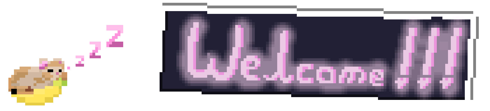

  
<a href="https://github.com/CertifiedHabibi/CertifiedHabibi">
  <picture>
    <source media="(prefers-color-scheme: dark)" srcset="https://raw.githubusercontent.com/CertifiedHabibi/CertifiedHabibi/main/dark_mode.svg">
    
  </picture>
</a>

  

# ALL ARTWORK IS DONE BY ME, DO NOT REUSE WITHOUT PERMISSION

